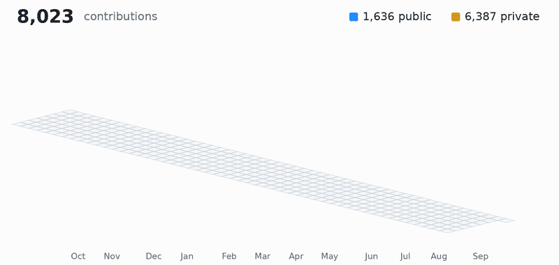

# Baz Iyer

Founder and Product Leader building with AI:

**Vulcan** · building energy modelling in Rust, WebAssembly and TypeScript
- **Community** · Open Source editor for the Home Energy Model. Supports imports of CAD files, tracing floor-plans, editing dwelling inputs in 2D or 3D views, validation and comparison of inputs with other energy models (e.g., SAP)
- **H3** · HEM HTC Harness (H3) compares and calibrates Home Energy Model outputs with in-use HTC measurements. H3 calculates the empirical HTC used by HEM's dynamic calculations, and proposes a schema to compare HTC measurements

**Dark Factory** · a local-first software factory for coding agents in Go
  
  and more coming soon...

<picture>
  <source media="(prefers-reduced-motion: reduce) and (prefers-color-scheme: dark)" srcset="chart-dark.svg">
  <source media="(prefers-reduced-motion: reduce)" srcset="chart-light.svg">
  <source media="(prefers-color-scheme: dark)" srcset="chart-dark.gif">
  
</picture>
